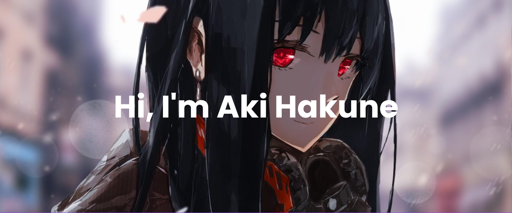

## About me

- I'm a computer science student
- My favourite area is ***cyber security***
- My go-to programming language is Python, and my favourite framework is Django. I can also do some C++ and Dart (Flutter)

- **Aiming for :**
  + **OSCP**. Hope I can "Try Harder" and make it the first time.
  + **SAT**. A decent SAT score is required for universities' admissions.
  + **IELTS**. Aiming for band 7.5.
  
- **Hobbies :**
  + **Rocket Science**. Because [make life multiplanetary](https://www.spacex.com/mission/) sounds exhilarating
  + **Japanese**. To understand Vtubers and manga
  + **Piano**. Mostly anime songs. Currently trying [zzz's cover of Sangenshoku](https://youtu.be/FimPPABP51Q).

 

## My Github stats

  
  

